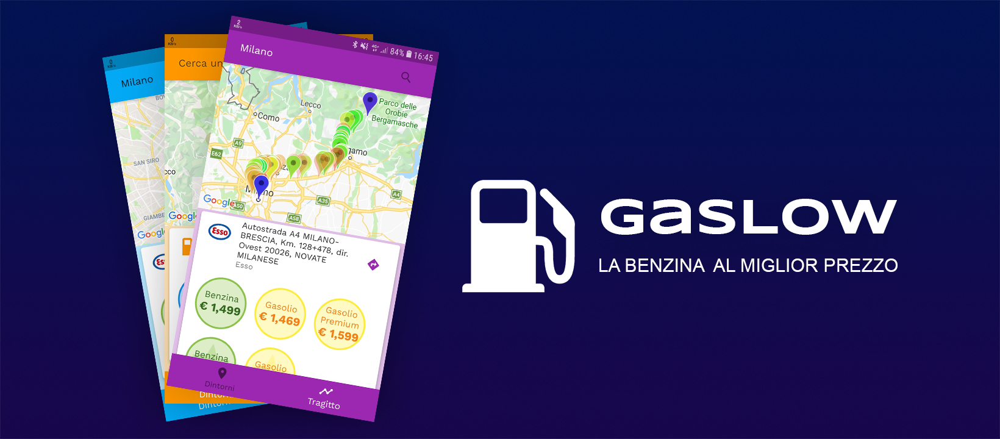

# Gaslow App

Flutter App to check gas station prices in Italy.
Available for [iOS](https://apps.apple.com/it/app/gaslow-prezzo-carburanti/id1510630580) and [Android](https://play.google.com/store/apps/details?id=it.mattianatali.gaslowapp&hl=it)

## Getting Started

- It is made with [Flutter](https://flutter.io/)
- [You can find its backend here](https://github.com/matitalatina/gaslow).
- Android deployment is automated with [fastlane](https://fastlane.tools/)
- Secrets are kept secure with [git-crypt](https://github.com/AGWA/git-crypt)
- [Landing page](https://gaslow.mattianatali.it/)

## Deployment

- Android: `make deploy-android`
- iOS: `make bundle-ios`. Then upload the ipa with [transporter](https://apps.apple.com/it/app/transporter/id1450874784?mt=12)

## Support my work

Everything I made is open source.
If you like what I'm doing and you want to support me, you can help me 😄!

- Put a good review on [Android](https://play.google.com/store/apps/details?id=it.mattianatali.gaslowapp&hl=it) or [iOS](https://apps.apple.com/it/app/gaslow-prezzo-carburanti/id1510630580) app.
- Sponsor me with [Github](https://github.com/sponsors/matitalatina)
- [Buy me a coffee](https://www.buymeacoffee.com/mattianatali)
- [Paypal](https://paypal.me/mattianatali)

TODO: fix animation too quick during loading
